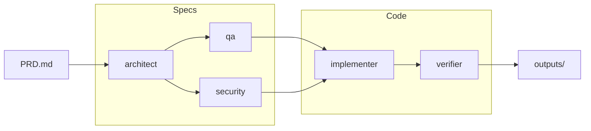

# Pagent

**Transform Product Requirements Documents (PRDs) into working software through 5 specialized AI agents.**

Pagent is a Claude Code plugin that orchestrates a self-driving pipeline of specialist agents to convert your PRD into architecture, test plans, security assessments, production-ready code, and verification reports.



## Quick Start

### Prerequisites

- [Claude Code](https://claude.ai/claude-code) installed and authenticated

### Installation

1. **Clone this repository:**
   ```bash
   git clone https://github.com/tuannvm/pagent.git
   cd pagent
   ```

2. **Install as a local Claude Code plugin:**
   ```bash
   claude plugin marketplace add $(pwd)
   claude plugin install pagent@pagent-local
   ```

3. **Verify installation:**
   ```bash
   claude plugin list | grep pagent
   ```

### Usage

Once installed, run the plugin from any Claude Code session:

```bash
# Start a pipeline with your PRD
/pagent-run ./examples/sample-prd.md

# Check pipeline status
/pagent-status

# Cancel active pipeline
/pagent-cancel
```

## How It Works

Pagent uses a **self-orchestrating pipeline** - each agent automatically hands off to the next when complete:

| Stage | Agent | Output | Description |
|-------|-------|--------|-------------|
| 1 | architect | `architecture.md` | System design, API contracts, data models |
| 2 | qa | `test-plan.md` | Test strategy, test cases, acceptance criteria |
| 2 | security | `security-assessment.md` | Threat model, security recommendations |
| 3 | implementer | `code/` | Complete, production-ready codebase |
| 4 | verifier | `verification-report.md` | Tests run, validation results |

Stages 2 (qa + security) run in parallel since they're independent.

## Commands

| Command | Description |
|---------|-------------|
| `/pagent-run <prd-file>` | Start pipeline with a PRD file |
| `/pagent-status` | Show current stage and progress |
| `/pagent-cancel` | Cancel the active pipeline |

## PRD Format

Your PRD should include:

- **Problem statement** - What are we solving?
- **Requirements** - Functional and non-functional requirements
- **Constraints** - Technical, business, or timing constraints
- **Success criteria** - How do we know it's done?

See [`examples/sample-prd.md`](examples/sample-prd.md) for a template.

## Outputs

After completion, you'll find:

```
outputs/
├── architecture.md           # System design from architect
├── test-plan.md              # Test strategy from qa
├── security-assessment.md    # Security review from security
├── code/                     # Working code from implementer
│   ├── src/
│   ├── tests/
│   └── README.md
└── verification-report.md    # Test results from verifier
```

## Architecture

Pagent v2 is a **Claude Code plugin** - a complete rewrite from v1's Go CLI architecture. The plugin uses:

- **Commands** - Claude Code slash commands for user interaction
- **Hooks** - Pipeline orchestration via stop hooks
- **Scripts** - Pipeline setup and state management

See [docs/architecture.md](docs/architecture.md) for technical details.

## Documentation

| Doc | Content |
|-----|---------|
| [Tutorial](docs/tutorial.md) | Step-by-step usage guide |
| [Architecture](docs/architecture.md) | Technical design and internals |
| [Roadmap](docs/roadmap.md) | Future plans |

## Development

Pagent is open source. See [CONTRIBUTING.md](CONTRIBUTING.md) for contribution guidelines.

## Roadmap

Currently supports **Claude Code** only. Coming next:

- **Multi-session support** - Resume pipelines across sessions
- **Custom agent configurations** - Define your own specialist agents
- **Integration tests** - Automated testing of the plugin itself
- **Better error recovery** - Graceful handling of agent failures

See [full roadmap](docs/roadmap.md).

## License

MIT
