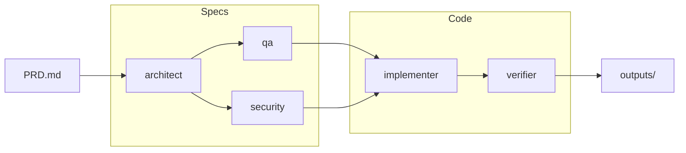

# Pagent

[](https://github.com/tuannvm/pagent/actions/workflows/build.yml)
[](https://goreportcard.com/report/github.com/tuannvm/pagent)
[](https://opensource.org/licenses/MIT)

CLI tool that orchestrates Claude Code agents to transform PRDs into specs and working code.



## Quick Start

```bash
# Install
git clone https://github.com/tuannvm/pagent && cd pagent && make install

# Launch the interactive TUI
pagent ui
```

The TUI guides you through selecting a PRD, persona, and running agents:

```
 ██████╗  █████╗  ██████╗ ███████╗███╗   ██╗████████╗
 ██╔══██╗██╔══██╗██╔════╝ ██╔════╝████╗  ██║╚══██╔══╝
 ██████╔╝███████║██║  ███╗█████╗  ██╔██╗ ██║   ██║
 ██╔═══╝ ██╔══██║██║   ██║██╔══╝  ██║╚██╗██║   ██║
 ██║     ██║  ██║╚██████╔╝███████╗██║ ╚████║   ██║
 ╚═╝     ╚═╝  ╚═╝ ╚═════╝ ╚══════╝╚═╝  ╚═══╝   ╚═╝

 From idea to implementation, orchestrated.

 Input                       Persona
 > examples/sample-prd.md    > Balanced - Standard

 Output                      Action
 > ./outputs                 > ▶ Run

 ↑ up · ↓ down · / filter · enter select
```

Or use the CLI directly:

```bash
pagent run ./prd.md --sequential -v
```

## Prerequisites

- [Claude Code](https://claude.ai/claude-code) installed and authenticated
- Go 1.21+ (for building from source)

## Installation

**From releases:** Download from [GitHub Releases](https://github.com/tuannvm/pagent/releases)

**From source:**
```bash
git clone https://github.com/tuannvm/pagent
cd pagent
make install
```

## Commands

| Command | Description |
|---------|-------------|
| `pagent run <prd>` | Run agents on PRD |
| `pagent ui [prd]` | Interactive dashboard |
| `pagent status` | Check running agents |
| `pagent logs <agent>` | View agent output |
| `pagent message <agent> "msg"` | Send guidance |
| `pagent stop [--all]` | Stop agents |
| `pagent init` | Create config file |

### Common Options

```bash
pagent run prd.md --agents architect,qa   # Run specific agents
pagent run prd.md --sequential            # Run in dependency order
pagent run prd.md --resume                # Skip up-to-date outputs
pagent run prd.md --output ./docs/        # Custom output directory
pagent run prd.md --persona minimal       # Use minimal persona
```

## Agents

| Agent | Output | Role |
|-------|--------|------|
| architect | `architecture.md` | System design, API, data models |
| qa | `test-plan.md` | Test strategy and cases |
| security | `security-assessment.md` | Threat model, mitigations |
| implementer | `code/*` | Complete codebase |
| verifier | `code/*_test.go` | Tests + verification |

## Configuration

Run `pagent init` to create `.pagent/config.yaml`. Key options:

- **persona**: `minimal` | `balanced` | `production`
- **preferences**: API style, testing depth, language
- **stack**: Cloud, database, CI/CD choices

See [docs/tutorial.md](docs/tutorial.md#configuration) for full config reference.

## Documentation

| Doc | Content |
|-----|---------|
| [Tutorial](docs/tutorial.md) | Step-by-step usage guide |
| [Architecture](docs/architecture.md) | Technical design and internals |
| [Roadmap](docs/roadmap.md) | Future plans |

## Troubleshooting

**"timeout waiting for agent"** - Check `claude --version`, increase `--timeout 600`

**"port already in use"** - Run `pagent stop --all`

See [docs/tutorial.md#troubleshooting](docs/tutorial.md#troubleshooting) for more.

## Contributing

See [CONTRIBUTING.md](CONTRIBUTING.md).

## Roadmap

Currently supports **Claude Code** only. Coming next:

- **Multi-LLM support** - Gemini, Codex, AMP
- **Simplified config** - Fewer options, smarter defaults
- **Better UX** - Guided setup, clearer outputs

See [full roadmap](docs/roadmap.md).

## Acknowledgments

This project is built on [AgentAPI](https://github.com/coder/agentapi) by [Coder](https://github.com/coder) - a brilliant HTTP wrapper for Claude Code that makes agent orchestration possible. Pagent wouldn't exist without it.

## License

MIT
