# Research Summary: Multi-Agent Orchestration for PM Workflows

## Executive Summary

This document captures research conducted in December 2025 on building a Product Manager (PM) agent system that can control multiple specialist sub-agents for product development workflows.


## Research Goals

Build an AI agent orchestration system where:
1. A PM agent controls multiple specialist sub-agents (Design, Tech Lead, QA, Security, Infra)
2. Each specialist receives PRD/requirements and produces their artifacts
3. Agents can run in parallel as separate processes
4. The PM can observe agents in real-time and "step into" any session to intervene
5. Human-in-the-loop approval gates for sensitive actions

## User Workflow Context

As a PM, the typical daily workflow is:
1. Login at 9 AM
2. Check requirements and goals
3. Create PRD (Product Requirements Document)
4. Hand off to specialists:
   - **Tech Lead** → TRD (Technical Requirements Document)
   - **Design Lead** → Design Spec
   - **QA Lead** → Test Plan
   - **Security Reviewer** → Security Assessment
   - **Infra Lead** → Infrastructure Plan

```mermaid
flowchart TB
    subgraph PM["🎯 PM Agent"]
        A[Login & Check Goals] --> B[Create PRD]
    end

    B --> C{Parallel Handoff}

    subgraph Specialists["👥 Specialist Agents"]
        C --> D[Tech Lead]
        C --> E[Design Lead]
        C --> F[QA Lead]
        C --> G[Security Reviewer]
        C --> H[Infra Lead]
    end

    D --> D1[TRD]
    E --> E1[Design Spec]
    F --> F1[Test Plan]
    G --> G1[Security Assessment]
    H --> H1[Infra Plan]

    subgraph Artifacts["📄 Deliverables"]
        D1 & E1 & F1 & G1 & H1 --> I[Review & Integrate]
    end

    I --> J[Approval Gate]
    J -->|Human Approval| K[Execute]
```



## Solutions Explored

### 1. Claude Code Built-in Agents

**Finding**: Claude Code has only 3 built-in agent types:
- `general-purpose` - Full tools, Sonnet model
- `plan` - Read/Glob/Grep/Bash, Sonnet model
- `explore` - Read-only, Haiku model

**Limitation**: Cannot define custom specialist agents. Subagents run to completion with no mid-execution intervention or real-time observation.

### 2. Custom Agents via `.claude/agents/`

**Finding**: Custom agents can be defined as Markdown files with YAML frontmatter:
```yaml
---
name: tech-lead
description: Technical Lead agent for TRD creation
tools:
  - Read
  - Write
  - Edit
  - Bash
model: sonnet
---

Instructions for the tech lead agent...
```

**Limitation**: These are prompt templates, not true orchestration primitives. No programmatic control.

### 3. Third-Party Frameworks

#### Santos-Enoque/magents
- Multi-Agent Claude Code Workflow Manager
- Docker containerization, git worktree isolation
- Task Master integration
- **Status**: Last updated October 2025 (stale, 5+ months)

#### mastra-ai/mastra (18,855 stars)
- TypeScript AI agent framework
- Agent Networks for multi-agent coordination
- Human-in-the-loop via suspend/resume
- Y Combinator W25 backed
- **Status**: Active, updated daily

#### VoltAgent/voltagent (4,213 stars)
- TypeScript framework with built-in observability (VoltOps)
- Supervisor + SubAgents pattern
- Suspend/resume for workflows
- **Status**: Active, updated daily

### 4. Claude Agent SDK (Official)

**Finding**: Anthropic's official SDK (`@anthropic-ai/claude-agent-sdk`) provides Claude Code as a library:

- **Built-in tools**: Read, Write, Edit, Bash, Glob, Grep, WebSearch, WebFetch
- **Subagents**: Via `Task` tool
- **Hooks**: PreToolUse, PostToolUse, Stop, SessionStart, SessionEnd
- **Sessions**: Resume, fork capability
- **MCP support**: Connect external systems
- **Permissions**: Fine-grained tool control

```mermaid
flowchart LR
    subgraph Solutions["Solution Landscape"]
        direction TB
        A["Claude Code\nBuilt-in Agents"]
        B["Custom Agents\n(.claude/agents/)"]
        C["Third-Party\nFrameworks"]
        D["Claude Agent SDK\n(Official)"]
    end

    A -->|"Limited to 3 types"| X[❌ Rejected]
    B -->|"Prompt templates only"| X
    C -->|"No SDK integration"| X

    D -->|"Native subagents\nBuilt-in tools\nHooks & Sessions"| Y[✅ Recommended]

    subgraph ThirdParty["Third-Party Options"]
        C1["magents\n⚠️ Stale"]
        C2["Mastra\n18.8k ⭐"]
        C3["VoltAgent\n4.2k ⭐"]
    end

    C --> C1 & C2 & C3
```



## Key Discovery

**Neither Mastra nor VoltAgent integrates with the Claude Agent SDK.** They are completely independent frameworks with their own LLM abstractions.

The Claude Agent SDK is the most direct path to building on Claude Code's capabilities:
- Same tools and agent loop as Claude Code
- Native subagent support
- Official Anthropic support
- TypeScript and Python SDKs

## Capability Comparison

| Feature | Claude Agent SDK | Mastra | VoltAgent |
|---------|------------------|--------|-----------|
| Built-in tools (Read, Write, Bash, etc.) | Native | Must implement | Must implement |
| Subagents | Via `Task` tool | Agent Networks | Supervisor pattern |
| Hooks | Native (Pre/PostToolUse) | Custom hooks | Custom hooks |
| Sessions (resume/fork) | Native | Snapshots | Workflow state |
| MCP servers | Native | Supported | Supported |
| Human-in-the-loop | Via hooks | suspend/resume | suspend/resume |
| Observability | Hook-based | Built-in | VoltOps |
| Claude-specific | Yes | No | No |

## Recommendation

**Use the Claude Agent SDK directly** for the PM workflow because:
1. Native subagent support via `Task` tool
2. Built-in tools already implemented
3. Session persistence for step-into capability
4. Hooks for observation and approval gates
5. Official Anthropic support and maintenance

Build a thin orchestration layer on top for:
- Dashboard UI for monitoring agents
- Approval workflow endpoints
- Multi-agent coordination
- Real-time WebSocket streaming

```mermaid
flowchart TB
    subgraph Orchestration["🖥️ Orchestration Layer"]
        Dashboard[Dashboard UI]
        API[API Server]
        WS[WebSocket Server]
    end

    subgraph SDK["⚙️ Claude Agent SDK"]
        PM[PM Agent]
        Hooks[Hooks System]
        Sessions[Session Manager]
        MCP[MCP Servers]
    end

    subgraph Agents["🤖 Specialist Agents"]
        Tech[Tech Lead]
        Design[Design Lead]
        QA[QA Lead]
        Security[Security]
        Infra[Infra Lead]
    end

    Dashboard <--> API
    API <--> WS
    API --> PM
    WS <-.->|Events| Hooks

    PM -->|Task tool| Tech
    PM -->|Task tool| Design
    PM -->|Task tool| QA
    PM -->|Task tool| Security
    PM -->|Task tool| Infra

    Hooks --> Sessions
    Sessions <--> MCP

    style Dashboard fill:#4a9eff,color:#fff
    style PM fill:#10b981,color:#fff
    style Hooks fill:#f59e0b,color:#fff
```



### Recommended Architecture (Sequence)


## References

- [Claude Agent SDK Documentation](https://docs.claude.com/en/docs/agent-sdk/overview)
- [Claude Agent SDK TypeScript](https://github.com/anthropics/claude-agent-sdk-typescript)
- [Claude Agent SDK Demos](https://github.com/anthropics/claude-agent-sdk-demos)
- [Mastra](https://github.com/mastra-ai/mastra)
- [VoltAgent](https://github.com/VoltAgent/voltagent)
