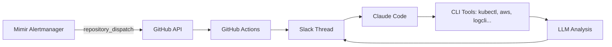

# LLM-Powered Oncall Investigation Agent - Implementation Plan

**Epic**: [PE-7838](https://vungle.atlassian.net/browse/PE-7838)
**TRD**: [PE-8838](https://github.com/Vungle/PE/pull/7001)
**Status**: Draft
**Last Updated**: 2025-12-24

---

## Overview

This document outlines the implementation plan for Phase 1 of the LLM-powered automated incident investigation agent. The goal is to build a working end-to-end pipeline for a single service/alert type and establish the golden template for runbooks.

## Architecture Summary



**Requirements for direct integration** (no bridge service needed):
- Mimir **2.17.0+**[^1] (August 15, 2025)
- Use `grafana_managed_receiver_configs` with custom `payload.template`[^2]
- `grafana-alertmanager-compatibility-enabled` is **optional**[^3] (only needed for testing endpoints)

---

## Phase 1: Implementation Tasks

### 1. Infrastructure Setup

#### 1.1 Mimir Alertmanager → GitHub Actions (Direct Integration)

Direct integration is possible with Mimir 2.17.0+ using custom webhook payloads[^2].

**Architecture**:
```
Mimir Alert → grafana_managed_receiver_configs (custom payload) → GitHub API → GitHub Actions
```

##### Prerequisites

| Requirement | Current State | Required State |
|-------------|---------------|----------------|
| Mimir version | 2.9.0 (June 2023) | **2.17.0+**[^1] (August 2025) |
| Receiver format | Prometheus (`webhook_configs`) | `grafana_managed_receiver_configs`[^4] |

##### Version Details

| Version | Release Date | Custom Payload Support |
|---------|--------------|------------------------|
| Mimir 2.9.0 | June 20, 2023 | No |
| Mimir 2.16.0 | March 31, 2025 | No |
| **Mimir 2.17.0** | **August 15, 2025** | **Yes**[^1] |
| Mimir 2.17.3 | December 1, 2025 | Yes (latest patch) |
| Mimir 3.0.1 | November 28, 2025 | Yes |

##### Alertmanager Configuration

Add `grafana_managed_receiver_configs` webhook receiver[^4][^6]:

```yaml
# In alertmanager_config
route:
  routes:
    - receiver: 'github-actions-oncall'
      matchers:
        - team_name = "pe"
        - llm_investigation = "enabled"  # Optional: label to enable per-alert

receivers:
  - name: 'github-actions-oncall'
    grafana_managed_receiver_configs:
      - uid: "github-dispatch-oncall"
        name: "GitHub Actions Dispatch"
        type: "webhook"
        disableResolveMessage: true
        settings:
          url: "https://api.github.com/repos/Vungle/pe-llm/dispatches"
          httpMethod: "POST"
          authorization_scheme: "Bearer"
          authorization_credentials: "<GITHUB_PAT_FROM_VAULT>"
          payload:
            template: |
              {
                "event_type": "alert-investigation",
                "client_payload": {
                  "alertname": "{{ .CommonLabels.alertname }}",
                  "severity": "{{ .CommonLabels.severity }}",
                  "runbook_url": "{{ .CommonLabels.runbook_url }}",
                  "team_name": "{{ .CommonLabels.team_name }}",
                  "vertical": "{{ .CommonLabels.vertical }}",
                  "tip": "{{ .CommonLabels.tip }}",
                  "instance": "{{ .CommonLabels.instance }}"
                }
              }
            vars:
              environment: "production"

  # Existing Prometheus receivers continue to work
  - name: 'pe-slack-notifications'
    slack_configs:
      - channel: '#dmx-pe-alerts'
        send_resolved: true
```

> **Note**: `grafana_managed_receiver_configs` coexists with existing Prometheus receivers[^4]. No migration of existing `slack_configs`, `pagerduty_configs` required.

##### Implementation Tasks

| Task | Description | Dependencies |
|------|-------------|--------------|
| Upgrade Mimir | 2.9.0 → 2.17.0+ (recommend 2.17.3) | Planning, testing |
| Create GitHub PAT | `repo` scope, store in Vault | None |
| Add webhook receiver | Add `grafana_managed_receiver_configs` with custom payload[^2] | Mimir upgraded |
| Add routing rule | Route pilot alerts to new receiver | Receiver configured |
| Test end-to-end | Fire test alert, verify GHA workflow runs | All above |

#### 1.2 GitHub Actions Workflow

| Task | Description | Dependencies |
|------|-------------|--------------|
| Create self-hosted runner on eks-ops-us-east-1c | Deploy Actions Runner Controller (ARC) or runner deployment on eks-ops-us-east-1c cluster | EKS cluster access, GitHub PAT |
| Create workflow file | `.github/workflows/oncall-investigation.yml` | None |
| Configure `repository_dispatch` trigger[^5] | Listen for `alert-investigation` event | Webhook receiver |
| Set up EKS runner | Use `pe-llm-eks-ops-1c-*` runners on eks-ops-us-east-1c | Runner deployed |
| Configure secrets | SLACK_BOT_TOKEN, ANTHROPIC_API_KEY | Vault setup |
| Add Claude Code installation | Install and configure Claude Code in runner | None |

**Workflow skeleton**[^7]:
```yaml
name: Oncall Investigation Agent
run-name: "Oncall Investigation - ${{ github.event_name == 'repository_dispatch' && github.event.client_payload.alertname || github.event.inputs.alertname }}"

on:
  repository_dispatch:
    types: [alert-investigation]

  # Manual trigger for testing with sample payload
  workflow_dispatch:
    inputs:
      alertname:
        description: 'Alert name'
        required: true
        default: 'TestAlert'
      severity:
        description: 'Alert severity'
        required: true
        default: 'warning'
        type: choice
        options: [critical, warning, info]
      runbook_url:
        description: 'GitHub blob URL to runbook'
        required: true
        default: 'https://github.com/Vungle/PE/blob/master/path/to/test-runbook.md'
      team_name:
        description: 'Team name'
        required: true
        default: 'pe'
      vertical:
        description: 'Vertical'
        required: true
        default: 'dmx'
      tip:
        description: 'Investigation tip'
        required: false
        default: 'Check pod logs and recent deployments'
      instance:
        description: 'Instance identifier'
        required: false
        default: 'test-pod-123'

jobs:
  investigate:
    runs-on: pe-llm-eks-ops-1c-small  # or pe-llm-eks-ops-1c-large for resource-intensive investigations
    steps:
      - uses: actions/checkout@v4

      - name: Extract alert data
        run: |
          # Handle both repository_dispatch and workflow_dispatch triggers
          if [ "${{ github.event_name }}" = "repository_dispatch" ]; then
            echo "ALERTNAME=${{ github.event.client_payload.alertname }}" >> $GITHUB_ENV
            echo "SEVERITY=${{ github.event.client_payload.severity }}" >> $GITHUB_ENV
            echo "RUNBOOK_URL=${{ github.event.client_payload.runbook_url }}" >> $GITHUB_ENV
            echo "TEAM_NAME=${{ github.event.client_payload.team_name }}" >> $GITHUB_ENV
            echo "VERTICAL=${{ github.event.client_payload.vertical }}" >> $GITHUB_ENV
            echo "TIP=${{ github.event.client_payload.tip }}" >> $GITHUB_ENV
            echo "INSTANCE=${{ github.event.client_payload.instance }}" >> $GITHUB_ENV
          else
            echo "ALERTNAME=${{ github.event.inputs.alertname }}" >> $GITHUB_ENV
            echo "SEVERITY=${{ github.event.inputs.severity }}" >> $GITHUB_ENV
            echo "RUNBOOK_URL=${{ github.event.inputs.runbook_url }}" >> $GITHUB_ENV
            echo "TEAM_NAME=${{ github.event.inputs.team_name }}" >> $GITHUB_ENV
            echo "VERTICAL=${{ github.event.inputs.vertical }}" >> $GITHUB_ENV
            echo "TIP=${{ github.event.inputs.tip }}" >> $GITHUB_ENV
            echo "INSTANCE=${{ github.event.inputs.instance }}" >> $GITHUB_ENV
          fi

      - name: Create Slack thread
        # Post initial message to Slack

      - name: Run Claude Code investigation
        # Execute investigation with runbook

      - name: Post results
        # Post findings to Slack thread
```

#### 1.3 Slack Integration

| Task | Description | Dependencies |
|------|-------------|--------------|
| Create Slack bot via manifest | Use App Manifest YAML to create bot[^8] | None |
| Configure OAuth scopes | `chat:write`, `channels:read`, `groups:read` | Bot created |
| Implement thread creation | Create thread on alert receipt | Bot configured |
| Implement update posting | Post diagnostic outputs and analysis to thread | Thread creation |
| Store bot token in Vault | Secure credential storage | Vault path defined |

**Slack App Manifest**[^8]:
```yaml
# Slack App Manifest for Oncall Investigation Bot
# Create at: https://api.slack.com/apps → "Create New App" → "From an app manifest"
_metadata:
  major_version: 1
  minor_version: 1

display_information:
  name: Oncall Investigation Agent
  description: LLM-powered oncall investigation assistant
  long_description: |
    Automated oncall investigation agent that analyzes alerts using Claude Code,
    executes runbook diagnostics, and posts findings to Slack threads.
    Triggered by Mimir Alertmanager webhooks via GitHub Actions.
  background_color: "#1a1a2e"

features:
  bot_user:
    display_name: oncall-investigator
    always_online: true
  app_home:
    home_tab_enabled: false
    messages_tab_enabled: true
    messages_tab_read_only_enabled: false

oauth_config:
  scopes:
    bot:
      # Post messages to channels the bot is a member of
      - chat:write
      # Post messages to any public channel (without joining)
      - chat:write.public
      # Read basic channel info (for thread creation)
      - channels:read
      # Read private channel info (if posting to private channels)
      - groups:read
      # Upload diagnostic files/logs as attachments
      - files:write
      # Read channel history (for context gathering)
      - channels:history
      # React to messages (for status indicators)
      - reactions:write

settings:
  org_deploy_enabled: false
  socket_mode_enabled: false
  token_rotation_enabled: false
  interactivity:
    is_enabled: false
```

**Create via Slack API** (alternative to UI):
```bash
# Create app from manifest using Slack API
curl -X POST https://slack.com/api/apps.manifest.create \
  -H "Authorization: Bearer $SLACK_CONFIG_TOKEN" \
  -H "Content-Type: application/json" \
  -d @slack-app-manifest.json
```

> **Note**: After creating the app, install it to your workspace and copy the `Bot User OAuth Token` (starts with `xoxb-`) to Vault.

---

### 2. Execution Environment

#### 2.1 Claude Code Configuration

| Task | Description | Dependencies |
|------|-------------|--------------|
| Create CLAUDE.md for oncall | Define agent behavior, allowed tools, constraints | None |
| Configure allowed CLI tools | kubectl, aws, argocd, logcli, etc. (see Section 4.1) | Runner image |
| Define prompt templates | System prompts for investigation and analysis | Runbook format |
| Configure token/context limits | Ensure responses fit within limits | None |

**CLAUDE.md structure**:
```markdown
# Oncall Investigation Agent

## Role
You are an automated incident investigation agent...

## Constraints
- Read-only operations only (no kubectl apply/delete, no write operations)
- Follow runbook procedures exactly
- Report explicitly when runbook guidance is insufficient

## Available Tools (CLI-first)
- Kubernetes: kubectl (get, describe, logs, top)
- AWS: aws cloudwatch, aws logs, aws ssm
- Observability: logcli, promtool, argocd
- Data stores: redis-cli, mongosh, kafka CLIs
- Network: tailscale, curl

## Output Format
- Post all findings to Slack thread
- Use structured markdown for readability
```

#### 2.2 Cluster Access

Access is managed entirely through IAM roles - no static credentials or SSH keys required.

| Task | Description | Dependencies |
|------|-------------|--------------|
| Runner node IAM role | EKS node role that runners inherit | EKS cluster config |
| Job IAM role (IRSA) | Service account with IAM role for job-specific permissions | IRSA setup |
| K8s RBAC | ClusterRole/RoleBinding for kubectl access to target namespaces | aws-auth ConfigMap |
| Test connectivity | Verify `kubectl`, CloudWatch, SSM access from runner | All IAM configured |

> **Note**: kubectl access is granted via K8s RBAC (aws-auth ConfigMap maps IAM role to K8s groups), not via IAM policies.

---

### 3. Core Logic

#### 3.1 Alert Payload Processing

The `runbook_url` is provided directly in the webhook payload as a GitHub blob URL (user-friendly format)[^9].

| Task | Description | Dependencies |
|------|-------------|--------------|
| Extract alert metadata | Parse `alertname`, `severity`, `team_name`, etc. from payload | Payload schema |
| Fetch runbook | Parse blob URL and fetch via `gh api` | `gh` CLI |
| Handle missing/invalid runbook | Post explicit message to Slack if fetch fails or URL empty | Slack integration |

**Payload → Runbook flow**:
```
webhook payload
    └─> runbook_url: "https://github.com/Vungle/PE/blob/master/.../runbooks/AlertName.md"
            └─> parse URL to extract owner/repo/path
                    └─> gh api repos/{owner}/{repo}/contents/{path} -H "Accept: application/vnd.github.raw"
                            └─> parse & execute
```

**Runbook fetch script**:
```bash
# Parse blob URL: https://github.com/Vungle/PE/blob/master/path/to/runbook.md
RUNBOOK_URL="$RUNBOOK_URL"
STRIPPED="${RUNBOOK_URL#https://github.com/}"
OWNER_REPO=$(echo "$STRIPPED" | cut -d'/' -f1-2)
FILE_PATH=$(echo "$STRIPPED" | sed 's|^[^/]*/[^/]*/blob/[^/]*/||')

gh api "repos/$OWNER_REPO/contents/$FILE_PATH" -H "Accept: application/vnd.github.raw"
```

#### 3.2 Runbook Parsing

Runbooks follow `docs/team-template-runbook.md` structure. Agent extracts:

| Section | What agent extracts | How it's used |
|---------|---------------------|---------------|
| `Common Commands` | bash code blocks | Execute for initial diagnostics |
| `Triage` tables | Observation → Scenario mapping | Guide decision tree based on command output |
| `Scenarios` | Resolution steps + code blocks | Execute remediation commands |
| `Verify Resolution` | Verification commands | Confirm fix worked |
| `Escalation` | DRI, Slack channel | Post if resolution fails |

| Task | Description | Dependencies |
|------|-------------|--------------|
| Parse markdown sections | Extract code blocks and tables from runbook | Runbook fetched |
| Execute diagnostics | Run `Common Commands` and capture output | kubectl/AWS access |
| Match observations to scenarios | Use `Triage` tables to select scenario | Diagnostic output |
| Execute resolution | Run scenario's resolution steps | Scenario identified |
| Validate runbook format | CI check on runbook commits (optional) | None |

#### 3.3 Data Sanitization

| Task | Description | Dependencies |
|------|-------------|--------------|
| Identify sensitive patterns | API keys, tokens, PII patterns | None |
| Implement redaction filters | Regex-based sanitization before LLM | Patterns defined |
| Test sanitization | Verify no sensitive data leaks | Filters implemented |

#### 3.4 Error Handling

| Task | Description | Dependencies |
|------|-------------|--------------|
| Define error taxonomy | Workflow errors vs diagnostic errors | None |
| Implement error formatting | Clear, actionable error messages | Taxonomy defined |
| Add retry logic | Retry transient failures (LLM timeout, rate limits) | None |
| Ensure visibility | All errors posted to Slack thread | Slack integration |

---

### 4. Tooling Setup

CLI tools are the primary interface - MCP servers are optional enhancements.

#### 4.1 Required CLI Tools

Pre-install in runner Docker image ([ref](https://github.com/Vungle/PE/pull/7001#issuecomment-3652814025)):

| Tool | Purpose | Installation |
|------|---------|--------------|
| `kubectl` | Kubernetes cluster access (pods, logs, events) | Official binary |
| `aws` | AWS CLI for EC2/EKS/CloudWatch | `awscli` package |
| `gh` | GitHub CLI for repo/Actions access | Official binary |
| `argocd` | ArgoCD deployment troubleshooting | Official binary |
| `logcli` | Loki log queries | Grafana release |
| `promtool` | Mimir/Prometheus rule validation | Prometheus release |
| `tailscale` | Network access to internal services | Official package |
| `redis-cli` | Redis/Kvrocks queries | `redis-tools` package |
| `mongosh` | MongoDB queries | MongoDB package |
| `kafka` CLIs | Kafka troubleshooting (console consumer/producer) | Kafka release |

#### 4.2 Runner Image Build

| Task | Description | Dependencies |
|------|-------------|--------------|
| Create Dockerfile | Ubuntu/Debian base with all CLIs installed, pinned versions | Tool list finalized |
| Build workflow | GitHub Actions triggered on Dockerfile changes | None |
| Push to GHCR | Tag with `latest` + commit SHA | `ghcr.io/vungle/pe-llm/oncall-runner` |
| Cache on runners | Self-hosted runners cache locally | Image built |


#### 4.3 Optional MCP Servers

MCP servers can provide structured tool interfaces but are not required:

| MCP Server | Purpose | Alternative CLI |
|------------|---------|-----------------|
| Slack MCP | Thread creation, message posting | `curl` + Slack API |
| Kubernetes MCP | Pod status, logs, events | `kubectl` |
| Grafana MCP | Metrics queries | `logcli`, `promtool` |

| Task | Description | Dependencies |
|------|-------------|--------------|
| Evaluate existing MCP servers | Check pe-llm repo for reusable servers | None |
| Configure if beneficial | Set up MCP servers that provide value over CLI | Evaluation done |

---

### 5. Pilot Execution

#### 5.1 Pilot Stack: LGPM (Loki, Grafana, Prometheus/Mimir)

Selected due to current hyperscale pressure and well-documented runbooks.

**Stack components**:
| Component | Location | Runbook Status |
|-----------|----------|----------------|
| Mimir | `inhouse-grafana/grafana-mimir-prod/` | ✅ Documented ([runbook.md](https://github.com/Vungle/PE/blob/master/inhouse-grafana/grafana-mimir-prod/runbook.md)) |
| kube-state-metrics | `observability/kube-state-metrics/` | ✅ Documented ([runbook.md](https://github.com/Vungle/PE/blob/master/observability/kube-state-metrics/runbook.md)) |

**Pilot alerts** (prioritized by frequency and impact):

| Alert | Runbook | Complexity | Why |
|-------|---------|------------|-----|
| `MimirIngesterDiskUsageHigh` | ✅ Complete | High | Multi-scenario (single vs all ingesters), scale out/up decisions |
| `MimirLimitsReaching` | ✅ Complete | Medium | Scaling formula, distributor/ingester decisions |
| `KubeStateMetricsDown` | ✅ Complete | Low | Good starter - straightforward diagnosis |
| `KubeStateMetricsShardsMissing` | ✅ Complete | Medium | Sharding issues during scale pressure |

**Existing runbook quality** (`grafana-mimir-prod/runbook.md`):
- ✅ Diagnosis commands with kubectl
- ✅ Multiple scenarios (single ingester vs cluster-wide)
- ✅ Clear resolution steps with commands
- ✅ Configuration change examples (values.yaml)

#### 5.2 Pilot Execution

**Channel**: `#triage-mx-llm-oncall` (new dedicated channel)

**Approach**: Enable all LGPM stack alerts from the start to maximize agent testing coverage.

| Alert | Expected Behavior | Success Metric |
|-------|-------------------|----------------|
| `MimirIngesterDiskUsageHigh` | Identify single vs cluster-wide, recommend scale out/up | Correct scenario identification |
| `MimirLimitsReaching` | Calculate scaling formula, identify component | Correct scaling recommendation |
| `KubeStateMetricsDown` | Diagnose pod status, check logs | Correct root cause identification |
| `KubeStateMetricsShardsMissing` | Identify missing shards, recommend action | Correct shard diagnosis |
| `KubeStateMetricsListErrors` | Check API errors, identify resource issues | Correct error categorization |
| `KubeStateMetricsWatchErrors` | Check watch stream issues | Correct error categorization |

**Success rate tracking** (pilot targets - iterate based on learnings):

| Metric | How to measure | Pilot Target | Notes |
|--------|----------------|--------------|-------|
| Execution success rate | Workflow completes without error / Total runs | >70% | New system, expect edge cases |
| Correct scenario identification | Manual review of agent's scenario selection | >50% | Learning phase, runbooks may need refinement |
| Actionable recommendations | Agent provides valid next steps | >50% | Accept partial credit if directionally correct |

**Feedback mechanism**:
- Slack reactions on analysis posts (👍/👎)
- Weekly review of failed/incorrect analyses
- Iterate on runbooks based on agent struggles

---

### 6. Monitoring & Observability

#### 6.1 Grafana Dashboard

| Panel | Metric | Target |
|-------|--------|--------|
| Success Rate | Successful / Total investigations | 95% |
| Time to Analysis | Webhook receipt → Final analysis | Track baseline |
| # of Iteration | Total iteration required for execution | Track baseline |

#### 6.2 Alerting

| Alert | Condition | Severity |
|-------|-----------|----------|
| Webhook receiver down | Health check fails | Critical |
| Workflow failures | 3+ consecutive failures | Warning |
| LLM API errors | Error rate >10% over 5min | Warning |

---

## Dependencies & Blockers

| Dependency | Owner | Status | Notes |
|------------|-------|--------|-------|
| EKS runner deployment | WA Team | Pending | Deploy runner on eks-ops-us-east-1c (see Section 1.2) |
| GitHub PAT for dispatch | WA Team | Pending | `repo` scope, store in Vault |
| **Mimir upgrade to 2.17.0+** | PE | **Required** | 2.9.0 → 2.17.3 for custom payloads[^1] |
| Slack bot creation | WA Team | Pending | Use App Manifest (see Section 1.3) |
| Runner tooling image | WA Team | Pending | Docker image with CLIs (see Section 4.2) |
| Claude API key | WA Team | Available | In Vault |

---

## Open Questions

1. ~~**Which alert type for pilot?**~~ **RESOLVED**: LGPM stack (Mimir, kube-state-metrics) - see Section 5.1

2. ~~**Runbook URL format?**~~ **RESOLVED**: Use GitHub blob URL (user-friendly). Agent parses and fetches via `gh api`:
   - Alert label: `runbook_url: https://github.com/Vungle/PE/blob/master/.../runbook.md`
   - Agent: `gh api repos/{owner}/{repo}/contents/{path} -H "Accept: application/vnd.github.raw"`

3. ~~**Slack channel for incidents?**~~ **RESOLVED**: `#triage-mx-llm-oncall` (new dedicated channel)

4. ~~**Runner image registry?**~~ **RESOLVED**: GHCR (`ghcr.io/vungle/pe-llm/oncall-runner`), built in pe-llm repo

5. **Mimir upgrade timeline?** When can 2.9.0 → 2.17.3 upgrade be scheduled?

---

## Success Criteria for Phase 1

- [ ] End-to-end pipeline works: Mimir alert → GitHub Actions → Slack thread → diagnostics → analysis
- [ ] Agent executes at least one runbook successfully using CLI tools
- [ ] PE team provides feedback on analysis quality
- [ ] Golden runbook template documented and validated (based on `docs/team-template-runbook.md`)
- [ ] Runner image with all CLI tools built and cached
- [ ] No silent failures - all errors visible in Slack thread

---

## References

### Project References
- [TRD: PE-8838](https://github.com/Vungle/PE/pull/7001)
- [Epic: PE-7838](https://vungle.atlassian.net/browse/PE-7838)

### Technical Documentation
- [GitHub repository_dispatch API](https://docs.github.com/en/rest/repos/repos#create-a-repository-dispatch-event)
- [Mimir Alertmanager docs](https://grafana.com/docs/mimir/latest/references/architecture/components/alertmanager/)
- [Mimir HTTP API](https://grafana.com/docs/mimir/latest/references/http-api/)

### Mimir Releases
- [Mimir 2.17.0](https://github.com/grafana/mimir/releases/tag/mimir-2.17.0) - August 15, 2025
- [Mimir 2.17.3](https://github.com/grafana/mimir/releases/tag/mimir-2.17.3) - December 1, 2025 (latest patch)
- [All Mimir releases](https://github.com/grafana/mimir/releases)

---

## Footnotes

[^1]: **Mimir 2.17.0 custom payload support** - Verified by checking `CustomPayload` struct in [vendor/github.com/grafana/alerting/receivers/webhook/config.go](https://github.com/grafana/mimir/blob/mimir-2.17.0/vendor/github.com/grafana/alerting/receivers/webhook/config.go). The struct includes `Template` and `Vars` fields for custom webhook payloads. Not present in Mimir 2.16.0 (verified via GitHub API). Feature added via [grafana/mimir#11195](https://github.com/grafana/mimir/pull/11195) which bumped `grafana/alerting` for templateable webhooks (merged April 11, 2025). Upstream support: [grafana/alerting#309](https://github.com/grafana/alerting/pull/309).

[^2]: **CustomPayload struct** - From [Mimir 2.17.0 source](https://github.com/grafana/mimir/blob/mimir-2.17.0/vendor/github.com/grafana/alerting/receivers/webhook/config.go):
    ```go
    type CustomPayload struct {
        Template string            `json:"template,omitempty" yaml:"template,omitempty"`
        Vars     map[string]string `json:"vars,omitempty" yaml:"vars,omitempty"`
    }
    ```
    Variables accessible in template via `.Vars.<key>`.

[^3]: **grafana-alertmanager-compatibility-enabled flag** - Added in Mimir 2.12.0 (April 3, 2024) via [PR #7057](https://github.com/grafana/mimir/blob/main/CHANGELOG.md). From [source code](https://github.com/grafana/mimir/blob/mimir-2.17.0/pkg/alertmanager/alertmanager.go#L335-L340), this flag **only** enables testing/migration API endpoints (`/api/v1/grafana/full_state`, `/api/v1/grafana/receivers`, `/api/v1/grafana/templates/test`, `/api/v1/grafana/receivers/test`). It is **NOT required** for `grafana_managed_receiver_configs` parsing - config parsing works regardless of flag.

[^4]: **grafana_managed_receiver_configs coexistence** - Verified from [Mimir 2.17.0 test file](https://github.com/grafana/mimir/blob/mimir-2.17.0/pkg/alertmanager/api_grafana_test.go). Example shows `grafana_managed_receiver_configs` and `email_configs` (Prometheus-style) in the same receivers array. From [alertmanager.go](https://github.com/grafana/mimir/blob/mimir-2.17.0/pkg/alertmanager/alertmanager.go), receiver types are handled by switch: `definition.GrafanaReceiverType` uses `buildGrafanaReceiverIntegrations`, `definition.AlertmanagerReceiverType` uses `buildReceiverIntegrations`.

[^5]: **GitHub repository_dispatch** - [GitHub API docs](https://docs.github.com/en/rest/repos/repos#create-a-repository-dispatch-event). Requires POST to `/repos/{owner}/{repo}/dispatches` with `{"event_type": "...", "client_payload": {...}}`. **Verified via `gh api -X POST repos/{owner}/{repo}/dispatches`**: payload format returns HTTP 204 success; exceeding 10 properties returns HTTP 422 `"No more than 10 properties are allowed"`. Document's payload uses 7 properties (alertname, severity, runbook_url, team_name, vertical, tip, instance) - within limit.

[^6]: **Webhook settings YAML field names** - Verified against [grafana/alerting receivers/webhook/v1/config.go](https://github.com/grafana/alerting/blob/main/receivers/webhook/v1/config.go). The `NewConfig` function defines struct tags that match YAML field names:
    ```go
    rawSettings := struct {
        URL                      string `json:"url,omitempty" yaml:"url,omitempty"`
        HTTPMethod               string `json:"httpMethod,omitempty" yaml:"httpMethod,omitempty"`
        AuthorizationScheme      string `json:"authorization_scheme,omitempty" yaml:"authorization_scheme,omitempty"`
        AuthorizationCredentials string `json:"authorization_credentials,omitempty" yaml:"authorization_credentials,omitempty"`
        Payload *CustomPayload          `json:"payload,omitempty" yaml:"payload,omitempty"`
        // ...
    }{}
    ```
    All YAML fields (`url`, `httpMethod`, `authorization_scheme`, `authorization_credentials`, `payload.template`, `payload.vars`) verified correct.

[^7]: **GitHub Actions workflow syntax** - Verified against [GitHub Actions contexts documentation](https://docs.github.com/en/actions/writing-workflows/choosing-what-your-workflow-does/accessing-contextual-information-about-workflow-runs). `github.event.client_payload.<property>` is correct for `repository_dispatch` events; `github.event.inputs.<property>` for `workflow_dispatch`. Dual-trigger pattern (`repository_dispatch` + `workflow_dispatch`) follows existing patterns in pe-llm repo (e.g., `llm-ersa.yml`, `llm-dione-v2-sync.yml`). `run-name` conditional syntax verified from repo examples.

[^8]: **Slack App Manifest** - [Slack App Manifests documentation](https://docs.slack.dev/app-manifests/). Manifests are YAML/JSON configuration bundles for Slack apps. Create via UI at https://api.slack.com/apps → "Create New App" → "From an app manifest", or via API using `apps.manifest.create`. See [App Manifest Reference](https://docs.slack.dev/reference/app-manifest/) for full schema. Scopes reference: [Slack Scopes](https://docs.slack.dev/reference/scopes). Key scopes: `chat:write` (post to channels bot is member of), `chat:write.public` (post to any public channel), `channels:read` (read channel info), `files:write` (upload attachments).

[^9]: **Runbook URL format** - Uses GitHub blob URL for user-friendliness (e.g., `https://github.com/Vungle/PE/blob/master/observability/kube-state-metrics/runbooks/KubeStateMetricsDown.md`). Agent parses URL and fetches via `gh api repos/{owner}/{repo}/contents/{path} -H "Accept: application/vnd.github.raw"`. **Verified**: `gh api` with `Accept: application/vnd.github.raw` header returns raw file content directly without base64 encoding. This matches existing alert label pattern from [dmx-monitoring/grafana/haproxy/haproxy_instances.yml](https://github.com/Vungle/dmx-monitoring/blob/master/grafana/haproxy/haproxy_instances.yml) which uses `runbook_url` label.
